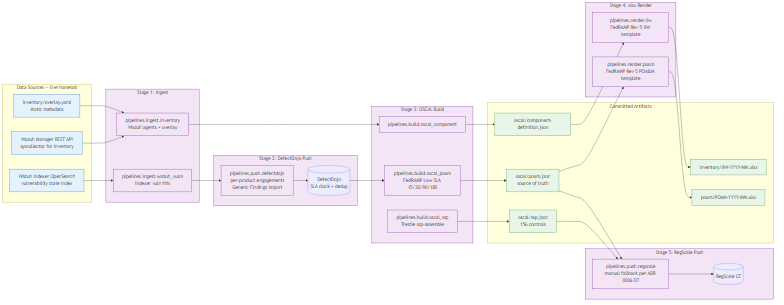

# HomeLab FedRAMP Low ConMon Program

> A working, evidence-backed FedRAMP Low continuous monitoring program for a
> notional "Managed SOC Service" offering, built on a functioning homelab SOC.
> OSCAL-native, aligned with FedRAMP RFC-0024's September 30, 2026 machine-readable
> authorization package mandate.


## What this is

A working FedRAMP Low Continuous Monitoring program built on a live homelab
SOC. I'm a 26-year Navy veteran running a production homelab for SOC,
detection, and threat-intel work, and this project extends that infrastructure
into the GRC (governance, risk, and compliance) side of cybersecurity. I've
managed POA&Ms in the military and done deep prior research on NIST SP 800-53
Rev 5, but I hadn't actually worked FedRAMP-specific Continuous Monitoring
end-to-end. Reading the catalog and running the program are different things.
This repo is the working artifact of running the program.

The "system" is a notional **Managed SOC Service (MSS)** built on top of my real
homelab SOC infrastructure. Everything is generated from live data: no fabricated
POA&M items, no hand-edited xlsx, no theatrical 3PAO reports.

## What's real, what's notional

| Real | Notional |
|---|---|
| The homelab SOC infrastructure (brisket, haccp, smokehouse, dojo, regscale) | The "MSS" commercial offering |
| Live Wazuh / ELK / Suricata / Zeek / OpenCTI scans and findings | The CSP business relationship |
| The 25,416 POA&M items and their state transitions in DefectDojo | The 3PAO assessment and AO approval |
| The OSCAL SSP / POA&M / IIW pipeline and its Trestle schema validation | The FedRAMP PMO submission workflow |
| The shared-tenancy compliance gap and OR-0001 DR (found during SSP authoring) | The annual authorization cycle |

## Quick tour (60 seconds)

| Artifact | Where | What |
|---|---|---|
| **SSP** (OSCAL) | [`oscal/ssp.json`](oscal/ssp.json) | 156-control assembled SSP, schema-valid |
| **SSP source** | [`trestle-workspace/mss-ssp/`](trestle-workspace/mss-ssp/) | One markdown file per control, organized by family |
| **POA&M** | [`poam/POAM-2026-04.xlsx`](poam/POAM-2026-04.xlsx) | FedRAMP Rev 5 template, populated from real findings |
| **April -> May diff** | [`conmon-submissions/`](conmon-submissions/) | Two consecutive ConMon cycles showing operational rhythm |
| **IIW** | [`inventory/IIW-2026-04.xlsx`](inventory/IIW-2026-04.xlsx) | FedRAMP Rev 5 template, live-sourced from Wazuh syscollector |
| **Deviation Requests** | [`deviation-requests/`](deviation-requests/) | All three FedRAMP DR categories (RA, FP, OR) |
| **SCR** | [`significant-changes/`](significant-changes/) | One Significant Change Request demonstrating boundary evolution |
| **OSCAL package** | [`oscal/`](oscal/) | Catalog, profile, component-def, SSP, POA&M: all schema-validated |
| **Pipelines** | [`pipelines/`](pipelines/) | Python code that regenerates everything from live homelab data |
| **ADR chain** | [`docs/adr/`](docs/adr/) | Execution decisions and deviations, 0001 to 0010 |
| **Main writeup** | [`writeups/01-building-fedramp-low-conmon-homelab.md`](writeups/01-building-fedramp-low-conmon-homelab.md) | Build narrative (~3,200 words) |
| **Paramify comparison** | [`writeups/02-paramify-vs-diy.md`](writeups/02-paramify-vs-diy.md) | Fair comparison post (~1,800 words) |

To regenerate the artifacts from current live state:

```bash
./pipelines.sh conmon
```

## Tooling inventory

| Tool | Status | Purpose |
|---|---|---|
| **DefectDojo 2.57** | Deployed on dojo VM (10.10.30.27) | Vulnerability management + FedRAMP Low SLA clock |
| **RegScale Community Edition** | Deployed on regscale VM (10.10.30.28) | GRC workflow + SSP / POA&M reporting UI |
| **Compliance Trestle 4.0.1** | Running on PITBOSS / Git Bash | OSCAL authoring + schema validation |
| **Wazuh Manager 4.14.4** | Existing homelab SIEM | Scan input for findings (5 in-boundary agents) |
| **OpenSearch** | Existing homelab (Wazuh Indexer) | Vulnerability state index for pipeline ingest |
| **Paramify** | Comparison post only (commercial SaaS, no self-host path) | See [writeup #2](writeups/02-paramify-vs-diy.md) |
| **ServiceNow GRC** | Not evaluated | Acknowledged for honesty |
| **Onspring** | Not evaluated | Acknowledged for honesty |

## How to read this repo

If you have **60 seconds**:

1. Scroll up to the boundary diagram.
2. Skim the "Quick tour" table above.
3. Open one POA&M xlsx, one DR markdown, one control markdown (try [`trestle-workspace/mss-ssp/si/si-4.md`](trestle-workspace/mss-ssp/si/si-4.md), the writeup hero control).

If you have **10 minutes**:

1. Read the [main writeup](writeups/01-building-fedramp-low-conmon-homelab.md).
2. Open [`deviation-requests/OR-0001-shared-tenancy.md`](deviation-requests/OR-0001-shared-tenancy.md) to see the compliance gap I found in my own environment.
3. Look at the April -> May diff in [`conmon-submissions/2026-05/README.md`](conmon-submissions/2026-05/README.md) to see the POA&M lifecycle in action.

If you're a **technical reviewer**:

1. Clone the repo, set up your `~/.env` per [`.env.example`](.env.example).
2. Run `./pipelines.sh install && ./pipelines.sh test` (136 tests pass).
3. Run `./pipelines.sh conmon` to regenerate the OSCAL output from live homelab data.
4. Walk the [ADR chain](docs/adr/) (0001 to 0010) to see every execution decision and deviation from the original plan.

## Writeups

- [Building a FedRAMP Low ConMon Program in a Homelab](writeups/01-building-fedramp-low-conmon-homelab.md) (main build narrative, ~12 min read)
- [Paramify vs. DIY: What a Few Hundred Lines of Python Replicates from a Commercial GRC Platform](writeups/02-paramify-vs-diy.md) (comparison post, ~7 min read)

Both posts are (or will be) cross-posted on:

- [brianchaplow.com](https://brianchaplow.com)
- [bytesbourbonbbq.com](https://bytesbourbonbbq.com)

## Why this exists

Most homelab compliance portfolios are paper. Someone reads a few NIST publications,
writes a pretend SSP against a pretend system, and calls it a portfolio project. This
repo is the opposite. Every POA&M item came out of a live Wazuh vulnerability scan
against the real homelab. Every OSCAL artifact was generated by a Python pipeline
against a real DefectDojo instance. The shared-tenancy gap the project documents
(OR-0001) was found by authoring the SSP against my actual running environment,
not invented to demonstrate that I know what a DR looks like.

The other reason is timing. FedRAMP RFC-0024 mandates OSCAL as the required submission
format for all authorization packages by **September 30, 2026**. Every CSP with an
Excel-first compliance workflow is going to have to retrofit OSCAL generation between
now and then, and the retrofit is hard. This pipeline starts OSCAL-first and projects
downward, which puts it on the right side of the deadline from day one.

## Project execution pattern

The project was built across four sequential plans:

| Plan | Status | Summary |
|---|---|---|
| Plan 1 | Done (2026-04-08) | Infrastructure: DefectDojo + RegScale CE VMs, Wazuh agents 016/017, PBS backup integration |
| Plan 2 | Done (2026-04-09) | OSCAL pipelines: Trestle + Python + 130 tests, 5 OSCAL artifacts from live homelab data |
| Plan 3 | Done (2026-04-10) | SSP authoring: 156 controls across 18 families, zero REPLACE_ME, 6 new verify-family.py tests |
| Plan 4 | In progress (2026-04-10) | ConMon cycles + DRs + SCR + writeups + portfolio polish (this README is the polish step) |

Each plan's completion is captured in an ADR in [`docs/adr/`](docs/adr/). ADR 0010 is
the pre-execution realignment for Plan 4, documenting the scope decisions that shaped
the final output.

## Pipelines at a glance



**Core principle** (from the design spec Section 5.1): OSCAL is the source of truth;
xlsx and markdown are projections. Every artifact is generated, never hand-edited.
Re-running `./pipelines.sh conmon` regenerates the entire monthly cycle from the
current state of DefectDojo and the Wazuh Indexer.

## About the author

**Brian Chaplow** -- 26-year Navy veteran and cybersecurity practitioner. Focus areas: SOC operations, detection engineering, threat intel, and the GRC layer of cybersecurity.

- [brianchaplow.com](https://brianchaplow.com)
- [github.com/brianchaplow](https://github.com/brianchaplow)
- LinkedIn: search for "Brian Chaplow"

## License

MIT. See [LICENSE](LICENSE).
