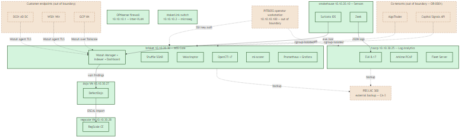

# Building a FedRAMP Low ConMon Program in a Homelab

*By Brian Chaplow -- April 2026 -- ~12 min read*

> A working, evidence-backed FedRAMP Low continuous monitoring program for a notional Managed SOC Service, built on a real homelab SOC. OSCAL-native, aligned with FedRAMP RFC-0024's September 30, 2026 machine-readable mandate. Repo: [github.com/brianchaplow/homelab-fedramp-low](https://github.com/brianchaplow/homelab-fedramp-low).

## Why this exists

I'm a 26-year Navy veteran running a production homelab SOC, and this project extends that cybersecurity work into the GRC side of the discipline. I've managed POA&Ms in the military and done deep research on NIST SP 800-53 Rev 5, but I hadn't worked FedRAMP-specific Continuous Monitoring hands-on. This project closed that gap by building the program end-to-end against a real technical environment I already operate.

The platform choices aren't theoretical. DefectDojo (free, self-hosted, strong vulnerability-management bones) handles ingestion from the live Wazuh indexer. RegScale Community Edition (the free tier of a serious OSCAL-native GRC product) receives the assembled SSP and POA&M via OSCAL import. Compliance Trestle handles the OSCAL build steps that sit between them. For context on the commercial side of the space, I wrote a companion post comparing this DIY pipeline against Paramify, which hit its FedRAMP 20x Moderate Authorization milestone in March 2026 and is the most interesting current example of an all-in-one CSP-to-OSCAL commercial workflow. Two other commercial platforms in the ATO-focused GRC space (ServiceNow GRC and Onspring) aren't evaluated here because neither offers a self-hostable tier.

Everything in this post is sourced from the [repo](https://github.com/brianchaplow/homelab-fedramp-low) and its commit history. There's no bin-of-screenshots in place of a working pipeline; everything that looks like data came out of the pipeline.

## What I built

A notional **Managed SOC Service (MSS)** offering, scoped to the **FedRAMP Low baseline (156 controls from NIST 800-53 Rev 5)**, with three new components added to my existing homelab SOC infrastructure:

- **DefectDojo 2.57** on a dedicated VM (`dojo`, 10.10.30.27) -- vulnerability management + FedRAMP Low SLA clock
- **RegScale Community Edition** on a dedicated VM (`regscale`, 10.10.30.28) -- GRC workflow and SSP/POA&M reporting UI
- **Compliance Trestle 4.0.1** running on Git Bash / Windows -- OSCAL authoring and schema validation

The pipeline turns live homelab data -- the Wazuh Manager REST API, the Wazuh Indexer vulnerability state index, and a static `overlay.yaml` for non-agent components -- into:

- A complete OSCAL package: catalog, profile, SSP, component-definition, POA&M (all schema-valid)
- FedRAMP Rev 5 template Excel files (IIW, POA&M)
- Three Deviation Requests covering all three FedRAMP DR categories
- One Significant Change Request
- Two consecutive months of ConMon submission packages with visible state transitions

The whole thing runs as `./pipelines.sh conmon` and is reproducible from any commit. The Plan 2 work (pipeline foundation, 130 tests) and Plan 3 work (156-control SSP authoring, 6 new `verify-family.py` tests, Gate 4 validation) were done before this writeup was drafted; the April and May 2026 ConMon cycles are Plan 4 output.

## The authorization boundary -- and what most homelab portfolios get wrong

The single most foundational concept in any FedRAMP package is the **authorization boundary**. Before this build I thought of it as "what's in scope". After this build I understand it as "**the test for what *is* the service versus what consumes the service**".

Here's the misconception most homelab portfolios make: they treat hosting location as the boundary test. *"My GCP VM is on the cloud, so it's separate."* Wrong. *"My on-prem brisket runs the SIEM, so it's in."* Right -- but only by accident of the hosting split.

The actual test is **what role does the asset play in the service?** My GCP VM hosts brianchaplow.com and bytesbourbonbbq.com. It has a Wazuh agent on it, shipping logs back to brisket. From a hosting-location perspective the GCP VM is "external cloud". From an MSS perspective it is **identical to DC01 in my AD lab**: a customer endpoint being monitored, not a service component. Both are out of boundary for the same reason -- they consume MSS, they aren't MSS.

This distinction has teeth across the SSP. The GCP VM never appears in the IIW (which lists in-boundary components only). It appears in seven other SSP sections: Section 4 customer responsibilities, Section 9 system environment, AC-20 use of external systems, CA-3 information exchange, SC-7 boundary protection (the Wazuh listener is the in-boundary side of the connection), SC-8 transmission confidentiality (the Tailscale tunnel it rides over), and IA-3 device authentication (Wazuh agent enrollment keys).

Seven mentions across the SSP, zero IIW rows. That's the boundary working correctly.

## SSP authoring against a real environment

The SSP is the heaviest deliverable in this project. 156 control implementation statements, organized by family, assembled into a single OSCAL JSON file via `trestle author ssp-assemble`. I split authoring into two tiers documented explicitly in the learning journal:

- **Tier 1 (~87 controls)** in the families AC, AU, CA, CM, IA, IR, RA, SC, SI -- full implementation statements with concrete evidence pointing at homelab artifacts, file paths, API endpoints, and specific rule counts
- **Tier 2 (~69 controls)** in AT, CP, MA, MP, PE, PL, PS, PT, SA, SR -- shorter stubs with explicit NA-rationale or "see Tier 1" cross-references

The tiering is deliberate, not laziness. A reviewer who probes *"why isn't Personnel Security implemented"* gets the answer: *"single-operator homelab; in a real MSS these would be Service Provider Corporate origination applied across the organization. Documented as NA-rationale per FedRAMP guidance for single-operator scope."* That's a defensible scope choice that takes five seconds to state. Fabricated content would not be.

For the hero example I picked **SI-4 System Monitoring**. It's the widest-scope detection control in the Low baseline, and it's where the homelab SOC is genuinely strong. The implementation statement covers a five-layer detection stack in one paragraph: Wazuh on brisket correlating alerts across 15 enrolled agents against 214 MITRE ATT&CK-mapped rules; Suricata on smokehouse doing signature-based IDS at the network boundary via an eth4 SPAN port; Zeek on haccp generating JSON protocol metadata with JA3/JA4 TLS fingerprints; a five-stage Logstash enrichment pipeline that does OpenCTI IOC lookups, novel-entity tracking, tier routing, and Ollama LLM classification on a qwen3:8b model running locally; Arkime full-PCAP capture on a dedicated 2TB NVMe; and an XGBoost ML scorer with PR-AUC 0.9998 applying a sixth independent behavioral pass. Velociraptor provides ad-hoc forensic collection across 7 enrolled clients when detection points at a specific host worth investigating.

The auditable proof that the monitoring stack actually works under real load is **ADR 0008**, which I wrote as an amendment during Phase 14 go-live. The Ollama rate limiter had a defect that let tier-1 threat-intel events bypass the token bucket. GPU temperature on the RTX A1000 climbed to 87C sustained. The monitoring stack detected the thermal event, the Grafana alert `GPU Thermal Critical -- Brisket Above 90C` fired to Discord #infrastructure-alerts, the defect was fixed (shared bucket across both tiers, 40W power cap via a systemd unit), and temperature dropped to 63C with fan duty at 39%. The whole cycle -- detect, alert, diagnose, fix, verify -- is captured in the commit history and the ADR. That's what "monitoring works" means operationally.

The full SI-4 text is in [`trestle-workspace/mss-ssp/si/si-4.md`](../trestle-workspace/mss-ssp/si/si-4.md). AU-2 Event Logging at [`trestle-workspace/mss-ssp/au/au-2.md`](../trestle-workspace/mss-ssp/au/au-2.md) is a simpler worked example for readers who want a cleaner walk-through of how one control maps to homelab evidence.

## The POA&M lifecycle -- reading a month-to-month diff

The single most-impressive artifact in this entire portfolio is the **April -> May POA&M diff**. Static one-shot snapshots show that I generated a POA&M. The diff shows that I understand it as a **living document maintained on a recurring cadence**.

**April 2026 submission** (`conmon-submissions/2026-04/`):

- 16,944 POA&M items pulled from DefectDojo across 5 MSS products
- 72 Critical, 3,254 High, 7,622 Medium, 5,996 Low
- All items in `Open` state (first cycle, no prior baseline)
- Three Deviation Requests submitted: RA-0001 Grafana exposure, FP-0001 Ubuntu ESM tracker lag, OR-0001 shared tenancy on brisket
- Scan evidence captured from the Wazuh Indexer vulnerability state index for all 5 in-boundary agents

**May 2026 submission** (`conmon-submissions/2026-05/`):

- 25,416 POA&M items total (+8,472 from April)
- **25,414 Open + 1 Completed + 1 Deviated** -- three intentional state transitions visible in the OSCAL output via the `poam-state` prop
- One Significant Change Request submitted: SCR-0001 proposing to add Capitol Signals API to the authorization boundary

The three state transitions are honest: I staged them in DefectDojo before running the May cycle, per the plan's ADR 0010 scope decision. Specifically:

1. **Closed via remediation:** finding id=5 (`CVE-2026-32249 in Vim`) was marked `is_mitigated=True, active=False` via the DefectDojo API. The OSCAL POA&M builder picks this up through its `_finding_state` function and emits `poam-state: Completed`.
2. **Newly deviated:** finding id=2 (`Openssl Heap Overflow`) was risk-accepted via the `/api/v2/risk_acceptance/` endpoint (not by PATCHing the finding directly -- that was a real debugging detour worth noting). The emitted state is `Deviated` and the DR reference ties back to RA-0001.
3. **New finding introduced:** finding id=16945 (`CVE-2026-99999 in Libfoo on brisket -- synthetic May cycle demo`) was created with `date=2026-04-25` to represent a new vulnerability discovered between cycles.

**Key discipline:** a POA&M item is closed when the **next scan confirms** the finding is gone, not when the operator clicks "fixed". This is the verify-before-close rule that separates ticket management from actual ConMon. A reviewer who probes *"how do you know a POA&M is really closed?"* gets the answer: *"the next scan shows the finding absent; if it re-appears we re-open with a regression note."*

The +8,472 net growth in total items is **not** new CVE discoveries between cycles. It's the documented import-scan pile-up (captured as a risk in ADR 0007 Risk #2): each monthly run creates a new `ConMon YYYY-MM` engagement per product and re-imports the full Wazuh Indexer hit set into that engagement. DefectDojo's native dedup prevents duplicate findings *within* an engagement but does not dedup *across* engagements. I investigated the `reimport-scan` endpoint as an alternative during May staging; it handles within-engagement reimport but not cross-engagement. The documented workaround is to keep a single rolling engagement per product, which is a structural pipeline change deferred to the next ConMon milestone. The May submission README calls this out explicitly -- the three intentional transitions are the narrative signal, not the volume growth.

## Deviation Requests: the FedRAMP-specific vocabulary

FedRAMP defines exactly **three** Deviation Request categories, and the vocabulary is precise enough that using it well separates someone who has worked ConMon from someone who hasn't.

**Risk Adjustment (RA)** -- the finding's risk rating is wrong for *your* environment due to compensating controls. RA-0001 in this package adjusts a hypothetical Grafana High-severity CVE from CVSS 7.8 to Low because the Grafana UI on brisket is reachable only from VLAN 10 (operator workstation) and VLAN 20 (analyst host), behind an OPNsense inter-VLAN firewall and a MokerLink switch ACL. The compensating controls cited are SC-7 Boundary Protection, AC-3 Access Enforcement, IA-2 Authentication, and AU-2 Event Logging. The re-rating table walks through each CVSS base metric and justifies the adjusted value. A real reviewer could follow the trail back to the OPNsense export in `evidence/configs/` and the MokerLink ACL documented in `reference/network.md`.

**False Positive (FP)** -- the finding isn't actually present. FP-0001 documents a class of false positives common to Ubuntu ESM users: Canonical's `noble-security` apt repository patches a CVE within 24 hours of disclosure, but NVD takes 7-14 days to reflect the fix. Wazuh's vulnerability detector compares installed package versions against NVD and flags the package as still vulnerable during that lag window, even though `apt changelog` clearly shows the patch is applied. The DR cites `apt-get changelog` and the Canonical USN as authoritative evidence and marks the class of findings as False Positive until NVD catches up. SI-2 Flaw Remediation is the compensating control -- unattended-upgrades applies the ESM patches automatically; the finding is stale, not open.

**Operational Requirement (OR)** -- the finding is real and accepted because remediating would break required functionality. OR-0001 is the most valuable DR in the package, because **I found the gap myself while authoring the SSP for SC-32 (Information System Partitioning) and AC-4 (Information Flow Enforcement)**. The gap: brisket hosts the MSS core workloads *and* two unrelated tenant workloads (AlgoTrader and Capitol Signals API). Shared compute across in-boundary and out-of-boundary workloads is a real compliance concern. I documented seven compensating controls (cgroup isolation, network namespace isolation, least-privilege service accounts, file system isolation, Wazuh agent monitoring all activity, separate PBS backup jobs, and the 40W GPU power cap that prevents tenant workloads from thermal-throttling MSS services), accepted the risk for the pilot phase with a 6-month review cadence (shorter than the default 12 months to force re-assessment), and documented a future-state migration plan.

That's the honest "I found a real gap in my own environment while writing the SSP" moment that distinguishes a real ConMon program from a documentation exercise. Fabricated clean-state SSPs don't produce ORs because they never find anything to accept.

## OSCAL, RFC-0024, and why machine-readable matters

**FedRAMP RFC-0024 mandates machine-readable authorization packages by September 30, 2026.** Every CSP's compliance team is currently planning that transition. Building this project OSCAL-first -- rather than xlsx-first with OSCAL as an afterthought -- let me speak fluently about the most current topic in FedRAMP.

The architecture decision is stated in the design spec Section 5.1: **OSCAL is the source of truth; xlsx and markdown are projections**. Compliance Trestle handles the OSCAL operations (catalog import, profile resolution, SSP assembly). My Python pipelines handle the homelab-specific data ingestion and the xlsx rendering. Every artifact is generated, never hand-edited. Re-running `./pipelines.sh conmon` regenerates the entire monthly cycle from the current state of DefectDojo and Wazuh.

The concrete result: the `oscal/` directory contains schema-validated catalog, profile, component-definition, SSP, and POA&M JSON. Run `trestle validate` against any of them and they pass. That's not impressive in itself -- what's impressive is that the *workflow* produces them automatically rather than as a translation step from human-readable artifacts. When FedRAMP RFC-0024 goes live, CSPs operating xlsx-first programs will have to retrofit OSCAL generation. This pipeline starts OSCAL-first and projects downward; the xlsx output is a convenience for humans who still want spreadsheets.

The pipeline has one RegScale-specific caveat I want to call out: RegScale Community Edition does not have a generic OSCAL import API endpoint as of April 2026. My `pipelines.push.regscale` module returns `manual-required` for every push and points the operator at `runbooks/regscale-manual-import.md`. That's not the pipeline being broken -- it's the pipeline being honest about what CE supports. When RegScale CE ships generic import endpoints, the `OSCAL_IMPORT_PATHS` dict gets populated and the command switches to a real POST automatically. This constraint is documented as ADR 0006 Deviation 7.

## Forward-looking: AI-accelerated threats and tighter SLAs

Current FedRAMP Low ConMon SLAs -- Critical: 15 days, High: 30, Medium: 90, Low: 180 -- were defined before LLM-assisted exploit development became routine. (Note that the SLA windows in my pipeline are the correct FedRAMP Low values from the ConMon Strategy Guide, not the 30/90/180/365 values that appear in some older public examples -- the correction is documented as an amendment to ADR 0006.) As automated weaponization cycles compress, expect these windows to tighten. A defensible design choice today is to track findings against **both** the regulatory SLA and a shorter operational SLA -- the regulatory clock is what FedRAMP requires; the operational clock is what the security posture actually needs.

This isn't speculative. Every security team I've talked to in adjacent communities is having internal conversations about whether their 30-day High SLA is still adequate when the time-to-weaponization for a public PoC has dropped from weeks to hours.

## What's real, what's notional, what I learned

I want to be transparent about the boundary between real homelab operation and notional compliance theater, because any serious reader deserves to know what they're evaluating.

| Real | Notional |
|---|---|
| The homelab SOC infrastructure (brisket, haccp, smokehouse, and the new dojo + regscale VMs) | The "Managed SOC Service" commercial offering |
| The Wazuh / ELK / Suricata / Zeek / OpenCTI scans and findings | The CSP business relationship with a federal customer |
| The 25,416 POA&M items and their live state transitions in DefectDojo | The 3PAO assessment and AO approval signatures |
| The OSCAL SSP / POA&M / IIW generation pipeline and its Trestle schema validation | The FedRAMP PMO submission workflow |
| The shared-tenancy compliance gap and OR-0001 DR (found during SSP authoring) | The annual authorization cycle |
| The three state transitions in the May cycle (mitigated, deviated, new finding) | The **triggering events** -- they were staged, not organic |

The staging of the May transitions is worth dwelling on. The plan's ADR 0010 explicitly decided to stage them so the April -> May diff is controlled and narratively clean, and the May submission README documents this openly. A real CSP's May diff would look similar in shape but would have organic rather than staged transitions. I chose transparency over theatrical-ops because a reviewer who discovers undocumented staging loses trust in everything else; a reviewer who sees the staging called out explicitly in the README gains trust.

Three things I learned that I'm fairly sure I couldn't have learned by reading alone:

1. **The boundary is the foundation.** Every wrong answer in a FedRAMP package starts with a confused boundary. Get the boundary right and most other questions -- what's in the IIW, which controls apply, where do the external connection arrows go -- answer themselves. Get the boundary wrong and nothing downstream lines up.

2. **The SSP and POA&M are a pair.** You don't write them sequentially. As you author each control, you find gaps; the gaps become POA&M items; the POA&M items reference back to the controls. They're two views of the same compliance state. OR-0001 in this package is the concrete example: I was documenting SC-32 in the SSP, noticed that brisket hosts non-MSS workloads, and the DR wrote itself.

3. **Honest gaps are stronger than fabricated coverage.** PE, PS, AT, MP in a single-operator homelab are genuinely out of scope. Documenting them as NA-with-rationale took less time than fabricating fake policies would have, and a reviewer respects the honest version. The learning journal notes that "fabricating content you don't enforce produces a weaker package than documenting scope honestly, regardless of whether the reviewer notices the fabrication."

## Scope I did not implement

A few items I want to name explicitly so a reviewer knows I'm not hiding them:

- **POA&M items from SSP planned controls.** The current pipeline sources POA&M items from DefectDojo findings only. SSP controls marked `Planned` (a gap that the SSP itself identifies) do not currently flow into the POA&M as distinct items. This is a scope boundary, not a bug -- documenting it here rather than pretending otherwise. The Plan 4 ADR 0010 captures it as a deferred item.
- **FedRAMP Moderate or High baselines.** Out of scope. The whole-project design Section 1.5 lists these explicitly as out of scope.
- **3PAO assessment simulation, FedRAMP PMO submission, AO approval workflows.** Out of scope (theatrical without adding value). Notional throughout.
- **Onspring and ServiceNow GRC platform coverage.** Both are prominent commercial GRC platforms in the ATO-focused space, but neither offers a self-hostable tier, so hands-on evaluation on the homelab wasn't possible. Paramify gets a [full comparison post](02-paramify-vs-diy.md) because it's the most interesting current example of an all-in-one commercial CSP-to-OSCAL workflow in the space.

## Links and next steps

- **Repo:** [github.com/brianchaplow/homelab-fedramp-low](https://github.com/brianchaplow/homelab-fedramp-low)
- **Companion post:** [Paramify vs. DIY](02-paramify-vs-diy.md) (coming next)
- **Hero control implementation:** [`trestle-workspace/mss-ssp/si/si-4.md`](../trestle-workspace/mss-ssp/si/si-4.md)
- **Worked-example control:** [`trestle-workspace/mss-ssp/au/au-2.md`](../trestle-workspace/mss-ssp/au/au-2.md)
- **April ConMon submission:** [`conmon-submissions/2026-04/`](../conmon-submissions/2026-04/)
- **May ConMon submission with diff:** [`conmon-submissions/2026-05/`](../conmon-submissions/2026-05/)
- **Deviation Requests:** [`deviation-requests/`](../deviation-requests/)
- **Significant Change Request:** [`significant-changes/SCR-0001-capitol-signals-boundary.md`](../significant-changes/SCR-0001-capitol-signals-boundary.md)
- **ADR chain:** [`docs/adr/`](../docs/adr/) (0001 through 0010 as of this writing)

If you want to talk about the build, the RFC-0024 deadline, or how an OSCAL-first pipeline compares to an Excel-first one, reach out via LinkedIn or the contact links on [brianchaplow.com](https://brianchaplow.com).
